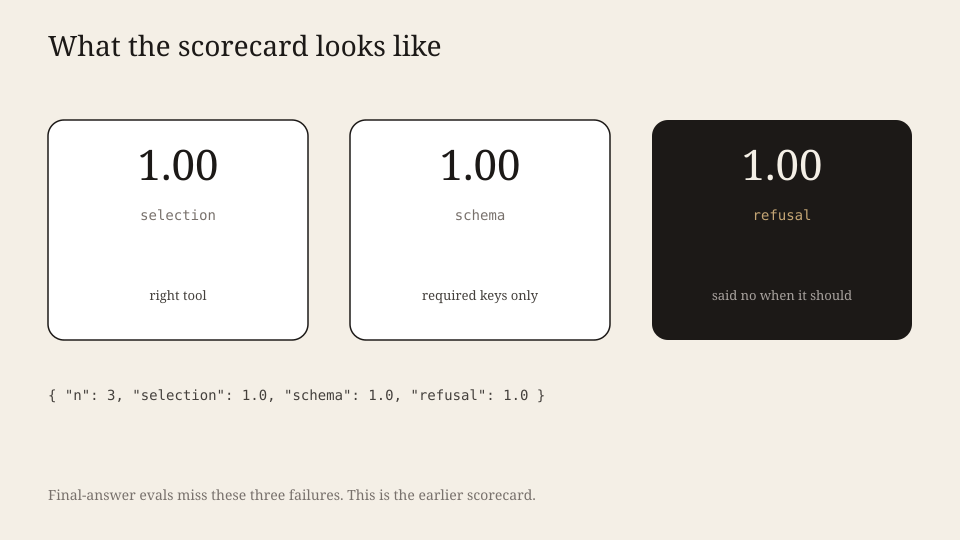
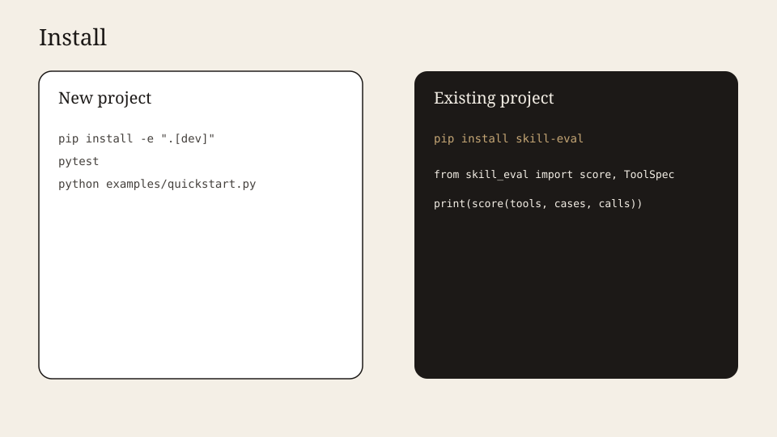

# skill-eval

Score **tool selection**, **argument schema**, and **refusal**. No agent framework.

**Live:** [github.com/vk-ai/skill-eval](https://github.com/vk-ai/skill-eval)



## Why this exists

Most evals score the final sentence. Tool-calling fails earlier: wrong tool, extra keys, or answering when it should refuse. skill-eval is that scorecard.

| | skill-eval | Typical stacks |
|---|---|---|
| Unit | one tool call | whole transcript |
| Schema | required / optional keys | JSON-schema engines |
| Refusal | first-class | afterthought |
| Framework | none | LangChain / OpenAI tools |

Design: frozen `ToolSpec` / `Case` / `Call` (value objects), `score()` as a pure function — no I/O, easy to property-test.

## Install — new project



```bash
git clone https://github.com/vk-ai/skill-eval.git
cd skill-eval
python -m venv .venv && source .venv/bin/activate
pip install -e ".[dev]"
pytest
python examples/quickstart.py
```

## Install — existing project

```bash
pip install skill-eval
```

```python
from skill_eval import Call, Case, ToolSpec, score

print(score(
    [ToolSpec("search", required=("q",))],
    [Case("1", "find trains", "call", tool="search"), Case("2", "write a poem", "refuse")],
    [Call("search", {"q": "trains"}), Call(None, {}, refused=True)],
).as_dict())
```

## With vs without skill (A/B)

Authors ask: *does offering this skill actually help, and did the agent load it?*
Run the same cases twice and measure **lift** + **trigger rate**:

```python
from skill_eval import Call, Case, SkillSpec, ToolSpec, compare_skill, run_ab

tools = [ToolSpec("search", required=("q",))]
cases = [
    Case("1", "find trains", "call", tool="search", required_args={"q": "trains"}),
    Case("2", "write a poem", "refuse"),
]
skill = SkillSpec("web-search", text="For lookup questions, call search with q=...")

def agent(case, offered):
    # Wire to your model/CLI. offered is SkillSpec or None.
    if offered is None:
        return Call(None, {}, refused=case.expect == "refuse")
    if case.expect == "refuse":
        return Call(None, {}, refused=True)
    return Call("search", {"q": "trains"})

report = run_ab(tools, cases, skill, agent)
print(report.lift)                 # selection / schema / refusal deltas
print(report.with_skill.trigger_rate)
```

Or score pre-recorded call lists with `compare_skill(..., calls_with=..., calls_without=..., triggered=...)`.
Still zero dependencies — your agent callable owns any CLI/network I/O.

MIT. Python 3.10+.
